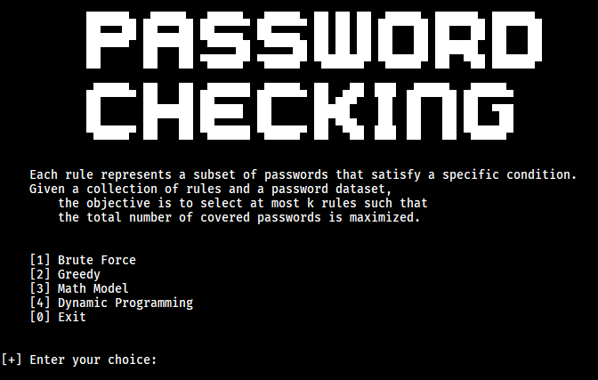

<p align="center">
  
</p>

# Password Checking Maximum Coverage

## Table of Contents

- [Overview](#overview)
- [Key Idea](#key-idea)
- [Project Features](#project-features)
- [How It Works](#how-it-works)
- [Algorithms](#algorithms)
- [Project Structure](#project-structure)
- [Output Files](#output-files)
- [Run the Program](#run-the-program)
- [Full Theory Description](#full-theory-description)

## Overview

`password_checking_maximum_coverage` is a small academic project that models password-rule selection as the **Maximum Coverage** problem.

Instead of checking a single password against a single rule, the project treats:

- the full list of passwords in `passwords.txt` as the **universe set**
- each rule as a **subset** of passwords that satisfy that rule
- the user-chosen value `k` as the number of subsets to select

The goal is to choose at most `k` rules so that the union of the selected rules covers as many passwords as possible.

This makes the project a practical demonstration of:

- NP and NP-hard problem modeling
- Maximum Coverage optimization
- exact search versus approximation
- bitmask-based set operations

## Key Idea

Let:

- `U` be the set of all passwords from `passwords.txt`
- `S_i` be the set of passwords covered by rule `i`
- `k` be the number of rules to choose

The optimization target is:

```text
maximize |S_1 ∪ S_2 ∪ ... ∪ S_k|
```

with the constraint:

```text
select at most k rules
```

In simple terms:

- each rule covers some passwords
- different rules may overlap
- the project tries to maximize total coverage while avoiding wasted overlap

## Project Features

- Reads passwords from `passwords.txt`
- Defines 7 candidate rules
- Lets the user choose an algorithm and a value of `k`
- Solves the Maximum Coverage problem using 4 different strategies
- Prints selected rules and covered passwords
- Writes the final result to an output file

## How It Works

The workflow is:

1. Load all non-empty lines from `passwords.txt`
2. Convert each rule into a bitmask
3. Let the user choose an algorithm
4. Let the user enter `k`
5. Run the selected solver
6. Measure time and memory usage
7. Save the final selected rules and covered passwords

The core implementation is in [`coverage_problem.py`](coverage_problem.py), which contains:

- rule predicates
- password loading
- bitmask conversion
- solver execution wrapper
- result formatting

## Algorithms

The project includes 4 solution methods:

### 1. Brute Force

Tries every possible combination of exactly `k` rules.

- Guarantees the optimal answer
- Very expensive when the number of rules grows

### 2. Greedy

Chooses the rule that adds the largest number of newly covered passwords at each step.

- Fast and simple
- Does not guarantee the global optimum

### 3. Math Model

Enumerates every subset of rules using bitmasks and evaluates the coverage exactly.

- Closely matches the mathematical formulation of Maximum Coverage
- Exact, but still exponential in the number of rules

### 4. Dynamic Programming

Uses recursion with memoization to avoid recomputing repeated states.

- Exact solution method
- More efficient than naive exhaustive search in repeated subproblems

For a full theoretical explanation of the problem, the NP-hardness background, and a detailed breakdown of every algorithm, see:

- [`description.md`](description.md)

## Candidate Rules

The project currently defines 7 rules:

1. The first character is uppercase
2. All characters are uppercase
3. All characters are lowercase
4. The last character is a digit
5. The last character is a special symbol
6. The first character is a special symbol
7. Standard password

Each rule represents a subset of passwords from the universe set.

## Project Structure

```text
.
├── banner.png
├── coverage_problem.py
├── description.md
├── passwords.txt
├── pwd_checking.py
├── README.md
├── rules.py
├── __init__.py
└── algorithms
    ├── Brute_Force.py
    ├── Dynamic_Programming.py
    ├── Greedy.py
    └── Math_Model.py
```

Notes:

- `coverage_problem.py` contains the shared logic and the exact solver implementations
- `pwd_checking.py` provides the main command-line menu
- `rules.py` handles rule selection and the `k` prompt
- each file in `algorithms/` is a small wrapper around one solving strategy

## Output Files

Each solver writes to its own output file, and the filename includes the selected rule ID:

- `output_brute_rule1.txt`
- `output_greedy_rule2.txt`
- `output_math_model_rule5.txt`
- `output_dp_rule7.txt`

The output contains only the final answer:

- the covered passwords
- or `null` if nothing is covered

It does not include:

- benchmark statistics
- the full contents of `passwords.txt`
- passwords that are not covered by the selected rules
- the selected rules themselves

If no result is available, the program prints `null`.

## Run the Program

```bash
python __init__.py
```

Then:

1. Choose an algorithm
2. Enter rule ('k')
3. View the selected rules and covered passwords

## Full Theory Description

For the detailed Vietnamese explanation of the theory, project behavior, and algorithm analysis, open:

- [`description.md`](description.md)
